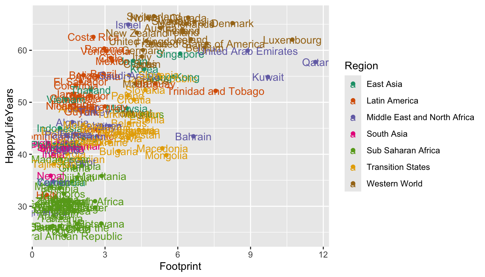

# Communication with `Quarto`

__Special Note__: `Quarto` and `.qmd` files and `R Markdown` and `.qmd` files are extremely similar. In the previous version of this section, I used `R Markdown`. Quarto has an advantage in that `.qmd` files also work with Python and Julia, so they are generally better for an all-purpose data scientist. If you spot any references to `R Markdown` or a `.qmd` file, just mentally convert `R Markdown` to `Quarto` and `.rmd` to `qmd`.

__Goals__:

* Explain what _reproducibility_ means and explain why it's important for analyses to be reproducible.

* Explain why `Quarto` provides more tools for making analyses reproducible than base `R` with Microsoft Word and than Microsoft Excel.

* Use the Code Options and the `Quarto` Text Options to modify an `Quarto` file so that it renders to a readable, professional .html file.

* Use titles, labels, colour scales, annotations, and themes to make your plots easy to read, including for people with Colour Vision Deficiency.

Overall: If you're making some quick plots just for you, some of the things on communication won't apply. But, if you're planning on sharing results (usually you are, eventually), then communication tools become much more important.

## Reproducbility

We've been using `Quarto` for a while now, but have not yet talked about any of its features or how to do anything except insert a new code chunk. By the end of this section, we want to be able to use some of the `Quarto` options to make a nice-looking document (so that you can implement some of these options in your first mini-project). 

__Reproducibility__ is a concept that has recently gained popularity in the sciences for describing analyses that another researcher is able to repeat. That is, an analysis is __reproducible__ if you provide enough information that the person sitting next to you can obtain identical results as long as they follow your procedures. An analysis is not reproducible if this isn't the case. 
`Quarto` makes it easy for you to make your analysis reproducible for a couple of reasons:

* an `Quarto` file will not render unless all of your code runs, meaning that you won't accidentally give someone code that doesn't work.

* `Quarto` combines the "coding" steps with the "write-up" steps into one coherent document that contains the code, all figures and tables, and any explanations.

### `R` Scripts vs. `Quarto`

We've been using `Quarto` for the entirety of this course. But, you may have noticed that when you go to File -> New File to open a new `Quarto Document` file, there are a ton of other options. The first option is `R Script`. Go ahead and open a new `R Script` file now.

The file you open should be completely blank. An `R Script` is a file that reads __only__ `R` code. It cannot have any text in it at all, unless that text is commented out with a `#`. For example, you could copy and paste all of the code that is inside a code chunk in a .qmd file to the .R file and run it line by line.

So, what are the advantages and disadvantages of using an `R Script` file compared to using an `Quarto` file? Let's start with the advantages of `Quarto`. `Quarto` allows you to fully integrate text explanations of the code and results, the actual tables and figures themselves, and the code to make those tables and figures in one cohesive document. As we will see, if using `R Script`s to write-up an analysis in Word, there is a lot of copy-pasting involved of results. For this reason, using `Quarto` often results in more reproducible analyses.

The advantage of an `R` Script would be in a situation where you really aren't presenting results to anyone and you also don't need any text explanations. This often occurs in two situations. (1) There are a lot of data preparation steps. In this case, you would typically complete all of these data prep steps in an `R script` and then write the resulting clean data to a .csv that you'd import in an `Quarto` file. (2) What you're doing is complicated statistically. If this is the case, then the code is much more of a focus than the text or creating figures so you'd use an `R` Script. 

We will "demo" a reproducible analysis in class.


### Spell-Checking

If using `Quarto` for communication, you probably want to utilize its spell-check feature. Go to Edit -> Check Spelling, and you'll be presented with a spell-checker that lets you change the spelling of any words you may have misspelled. 

### Exercises {#exercise-5-1}

Exercises marked with an \* indicate that the exercise has a solution at the end of the chapter at \@ref(solutions-5).

1. What's the difference between `R` and `Quarto`?


2. Why is an `Quarto` analysis more reproducible than the base `R` script analysis?


3. Why is an `Quarto` analysis easier to make more reproducible than an analysis with Excel?


4. Your friend Chaz is doing a data analysis project in Excel to compare the average GPA of student athletes with the average GPA of non-student athletes. He has two variables: whether or not a student is a student athlete and GPA. He decides that a two-sample t-test is an appropriate procedure for this data (recall from Intro Stat that this procedure is appropriate for comparing a quantitative response (GPA) across two groups). Here are the steps of his analysis.

a. He writes the null and alternative hypotheses in words and in statistical notation.

b. He uses Excel to make a set of side-by-side boxplots. He changes the labels and the limits on the y-axis using Point-and-Click Excel operations.

c. From his boxplots, he see that there are 3 outliers in the non-athlete group. These three students have GPAs of 0 because they were suspended for repeatedly refusing to wear masks indoors. Chaz decides that these 3 students should be removed from the analysis because, if they had stayed enrolled, their GPAs would have been different than 0. He deletes these 3 rows in Excel.

d. Chaz uses the t.test function in Excel to run the test. He writes down the degrees of freedom, the T-stat, and the p-value.

e. Chaz copies his graph to Word and writes a conclusion in context of the problem.

State 2 aspects of Chaz's analysis that are __not__ reproducible.


## `Quarto` Files

Let's talk a bit more about the components of the `Quarto` file used to make the reproducible analysis shown in class.

First, open a new `Quarto` file by clicking File -> New File -> `Quarto Document` and keep the new file so that it renders to HTML for now. 

The first four to five lines at the top of the file make up the YAML (__Yet Another Markup Language__) header. We'll come back to this at the end, as it's the more frustrating part to learn.

Delete the code below the YAML header and then paste the following code chunks to your clean .qmd file:


```r
library(tidyverse)
head(cars)
ggplot(data = cars, aes(x = speed, y = dist)) +
  geom_point()
```


```r
summary(cars)
```

The `cars` data set is built into `R` so there's no need to do anything to read it in (it already exists in `R` itself). 

### Code Chunk Options

First, render your new file (and give it a name, when prompted). You should see some code, a couple of results tables, and a scatterplot.

Chunk options allow you to have some control over what gets printed to the file that you render. For example, you may or may not want: the code to be printed, the figure to be printed, the tables to be printed, the `tidyverse` message to be printed, etc. There are a ton of chunk options to give us control over the code and output that is shown! We are going to just focus on a few that are more commonly used. 

The options below are common `execute` options in `Quarto`. 

* `echo`. This is set to either `true` to print the code or `false` to not print the code. In a blank line after ` ```{r} `, insert the following, which tells `Quarto` not to print the code in that chunk: `#| echo: false`. Then, re-render your document to make sure that the code making the plot is actually hidden in the .html output.

You can keep adding other options on new lines. Some other options include:

* `warning`. This is set to either `true` to print warnings and messages or `false` to not print warnings and messages. For example, when we load in the `tidyverse`, a message automatically prints out. In that same code chunk, add a new line with `#| warning: false` to get rid of the message. Re-render to make sure the message is actually gone.

* `output`. By default, this is set to `true` and shows output of tables and figures. Change this to `false` to not print any output from running code. Practice adding a `#| output: false` to the code chunk in your `Quarto` file with `summary(cars)` and re-render to make sure the output from `summary(cars)` is gone.

* `eval`. `eval` is set to `true` if the code is to be evaluated and `false` if not. 

Besides `execute` options, there are also options pertaining to the size of figures and figure captions. Some common examples include

* `fig-height` and `fig-width` control the height and width of figures. By default, these are both 7, but we can change the `fig-height` and `fig-width` to make  figures take up less space in the rendered .html document (`fig-height: 5`, for example).

* `fig-cap` adds a figure caption to your figure. Try inserting `#| fig-cap: "Figure 1: caption text blah blah blah"` to your chunk options for the chunk with the plot. 

### Global Options

What we have discussed so far is how to change code and output options for individual chunks of code. But, it can be a pain to add a certain option to every single chunk of code that we want the option to apply to. What we can do instead is change the __global option__ for the code and/or output options so that they apply to all code chunks, unless specifically overwritten in that chunk.

We can change the `execute` options (`echo`, `warning`, `eval`, `output`, and more) globally by adding a line to the YAML header at the top of your `Quarto` file. Try adding

```
execute: 
  echo: false
```

as two new lines in between the `title` and `format` lines of the YAML header. This tells `Quarto` to not `echo` __any__ code in any code chunk. However, note that you can change a local code chunk to have `#| echo: true` to override the global setting for that chunk.

Additional global `execute` options go on new lines:

```
execute: 
  echo: false
  warning: false
```

The non-`execute` options pertaining to figure size can be changed globally by specifying the option after the `html` part of the YAML header. The following changes all figure heights to be `2`, unless a chunk overrides the global setting:

```
---
title: "Quarto Test"
execute: 
  echo: false
format: 
  html:
    fig-height: 2
---
```


__Important Note__: We need to pay particular attention to the spacing of things in the YAML header. Notice, for example, that `echo: false` is indented by exactly two spaces. Try adding a space or deleting a space, and you'll get an error!

### Figures and Tables

We've already seen that Figures will pop up automatically (unless we set `output: false`), which is quite convenient. Making tables that look nice requires one extra step.

Delete the `output: false` option that you added earlier to the chunk with `summary(cars)`. When you render your .qmd file now, results tables from `head(cars)` and `summary(cars)` look kind of ugly. We will focus on using the `kable()` function from the `knitr` package to make these tables much more aesthetically pleasing. Another option is to use the `pander()` function in the `pander` package. Both `pander()` and `kable()` are very simple functions to generate tables but will be more than sufficient for our purposes. To generate more complicated tables, see the `xtable` package.

To use these functions, simply add a `|>` pipe with the name of the table function you want to use. `head(cars) |> kable()` will make a nice-looking table with `kable` and `head(cars) |> pander()` will use `pander()`. Before using `kable()` from the `knitr` package, you'll need to install the `knitr` package with `install.packages("knitr")` and load its library by adding the line `library(knitr)` above `head(cars) |> kable()`. Before using `pander()`, you'll need to install the `pander` package with `install.packages("pander")` and then load its library by adding the line `library(pander)` above `head(cars) |> pander()`. Try these out in your `Quarto` file.

Which table do you like better in this case?

There are plenty of options for making tables look presentable, which we will discuss in the Exercises. Keep in mind that you probably wouldn't use these when making tables for yourself. They're much more useful when you're writing a report that you want to share with others.

### Non-Code Options

`Quarto` combines `R` (in the code chunks, which we've already discussed) with the `Markdown` syntax, which comprises the stuff outside the code chunks, like what you're reading right now!

There are so many `Markdown` options, but most of the time, if you want to do something specific, you can just Google it. The purpose of what follows is just to get us familiar with the very basics and things you will probably use most often.

__Bullet Points and Sub-bullet Points__: Denoted with a `*` and `-`, respectively. The sub bullets should be indented by 4 spaces. Note that bullet points are not code and should __not__ appear in a code chunk.

```
* Bullet 1
* Bullet 2
    - Sub bullet 1
    - Sub bullet 2
    - Sub bullet 3
```

<!-- See Ordered and Unordered Lists in <a href="https://rmarkdown.rstudio.com/authoring_basics.html" target="_blank">https://rmarkdown.rstudio.com/authoring_basics.html</a>  for an example. -->

__Note__: Everything in `Markdown` is very particular with spacing. Things often have to be very precise. I personally just love it, but it can be frustrating sometimes. For example, indenting a sub-bullet by __3__ spaces instead of __4__ spaces will not make a sub-bullet.

```
* Bullet 1
   - Sub bullet 1
```

Numbered Lists are the same as bulleted ones, except `*` is replaced with numbers `1.`, `2.`, etc.

__Bold, Italics, Code__. Surround text with `__bold text__` to make text bold, `_italic text_` to make text Italics, and backticks to make text look like Code. 

__Links__: The simplest way to create a link to something on the web is to surround it with `< >` as in `<https://www.youtube.com/watch?v=gJf_DDAfDXs>`

If you want to name you link something other than the web address, use `[name of link](https://www.youtube.com/watch?v=gJf_DDAfDXs)`, which should show up in your rendered document as "name of link" and, when clicked on, take you to the youtube video.

__Headers__: Headers are created with `##` with fewer hashtags resulting in a bigger Header. Typing in `#Big Header` at the beginning of a line would make a big header, `### Medium Header` would make a medium header, and `##### Small Header` would make a small header. Headers are important because they get mapped to a table of contents.

There's a lot of other stuff to explore: <a href="https://rstudio.com/wp-content/uploads/2015/03/rmarkdown-reference.pdf" target="blank> https://rstudio.com/wp-content/uploads/2015/03/rmarkdown-reference.pdf </a>.

But, if you want to do something other than the basics, Google will definitely help.

### YAML

We have briefly discussed what's given at the top of every .qmd file: the YAML header. The YAML header is the most frustrating part to change because it's the most particular with spacing.

In addition to controlling global chunk options, we can also use the YAML header to specify a theme from <a href="https://quarto.org/docs/output-formats/html-themes.html" target="_blank"> Bootswatch.</a>

There are 25 themes in the `Bootswatch` project. The YAML header below uses the `darkly` theme. Try pasting in this YAML header and rendering the document to see the outputted theme.

```
---
title: "Quarto Test"
execute: 
  echo: false
  warning: false
format: 
  html:
    fig-height: 2
    theme: darkly
    self-contained: true
---
```

We can also add a table of contents, which will create a table of contents based on headers you have created with `##`. 

```
---
title: "Quarto Test"
execute: 
  echo: false
  warning: false
format: 
  html:
    fig-height: 2
    theme: darkly
    toc: true
    self-contained: true
---
```

There are __so__ many other options available for theming, and, if you know any `css`, you can provide your own `.css` file to customize the theme.


### Exercises {#exercise-5-2}

Exercises marked with an \* indicate that the exercise has a solution at the end of the chapter at \@ref(solutions-4).

For the rest of this section, we will use the built-in `R` data set `mtcars`, which has observations on makes and models of cars. The variables we will be using are:

* `cyl`, the number of cylinders a car has
* `mpg`, the mileage of the car, in miles per gallon

Because the data set is loaded every time `R` is started up, there is no need to have a line that reads in the data set. We can examine the first few observations with


```r
head(mtcars)
#>                    mpg cyl disp  hp drat    wt  qsec vs am
#> Mazda RX4         21.0   6  160 110 3.90 2.620 16.46  0  1
#> Mazda RX4 Wag     21.0   6  160 110 3.90 2.875 17.02  0  1
#> Datsun 710        22.8   4  108  93 3.85 2.320 18.61  1  1
#> Hornet 4 Drive    21.4   6  258 110 3.08 3.215 19.44  1  0
#> Hornet Sportabout 18.7   8  360 175 3.15 3.440 17.02  0  0
#> Valiant           18.1   6  225 105 2.76 3.460 20.22  1  0
#>                   gear carb
#> Mazda RX4            4    4
#> Mazda RX4 Wag        4    4
#> Datsun 710           4    1
#> Hornet 4 Drive       3    1
#> Hornet Sportabout    3    2
#> Valiant              3    1
```

1. \* Create a table showing the mean `mpg` for each `cyl` group (`cyl` stands for cylinder and can be 4-cylinder, 6-cylinder, or 8-cylinder) with both `kable()` and `pander()`. Hint: remember to call the `knitr` library and the `pander` library.

2. \* Type `?kable` into your console window and scroll through the Help file. Change the rounding of the mean so that it only displays one number after the decimal. Then, add a caption to the table that says "My First Table Caption!!"

3. \* Google "How to Change Column Names in kable" and replace the column names with "Cylinder Numb." and "Mean Mileage".

4. Find a table that you plan to use in your first mini-project. Use the column names, caption, and digits options to make this table look nicer with the `kable()` function. 


5. Create a new `R` chunk and copy and paste the following into your new `R` chunk. Don't worry about what `factor()` is doing: we will cover that next week!


```r
library(tidyverse)
head(mtcars)
ggplot(data = mtcars, aes(x = factor(cyl), y = mpg)) +
  geom_boxplot()
```

Modify the `R` chunk so that: (a) the figure height is 3, (b) the code from the `R` chunk shows in the .html file, (c) the table from running `head(cars)` are hidden in the .html file. Make (b) and (c) a __local__ chunk option, but set (a) as a __global__ option that applies to all of your `R` chunks.


6. Change your global options in your first project to (a) hide messages from loading in the `tidyverse` and (b) show all code.

7. Use bullet points in the Introduction in your first mini-project that explains what a few of the important variables are. Then, add a header to your project that marks the Introduction.

8. Change the YAML header in your project so that you are the Author (with something like `author: "Your Name"` and so that the file uses a theme from `Bootswatch` other than the default theme.

## `ggplot2` Communication

When we first introduced plotting, we used histograms, boxplots, frequency plots, bar plots, scatterplots, line plots, and more to help us explore our data set. You will probably make many different plots in a single analysis, and, when exploring, it's fine to keep these plots unlabeled and untitled with the default colour scheme and theme. They're just for you, and you typically understand the data and what each variable means. 

However, when you've finished exploring and you'd like to communicate your results, both graphically and numerically, you'll likely want to tweak your plots to look more aesthetically pleasing. You certainly wouldn't be presenting every exploratory plot you made so this tweaking needs to be done on only a few plots. You might consider:

* changing the x-axis and y-axis labels, changing the legend title, adding a title, adding a subtitle, and adding a caption with `+ labs()`

* changing the limits of the x-axis and y-axis with `+ xlim()` and `+ ylim()`

* changing the colour scheme to be more visually appealing and easy to see for people with colour-vision-deficiency (CVD)

* labeling certain points or lines with `+ geom_label()` or `+ geom_text()`

* changing from the default theme with `+ theme_<name_of_theme>()`

The bullet about labeling only certain points is the data set is one reason why we are doing this second `ggplot2` section now, as opposed to immediately after the first `ggplot2` section. As we will see, we'll make use of combining what we've learned in `dplyr` to help us label interesting observations in our plots. 

__The Data__

The Happy Planet Index (HPI) is a measure of how efficiently a country uses its ecological resources to give its citizens long "happy" lives. You can read more about this data here: <a href="https://static1.squarespace.com/static/5735c421e321402778ee0ce9/t/578dec7837c58157b929b3d6/1468918904805/Methods+paper_2016.pdf" target="_blank"> here</a>.

But, the basic idea is that the HPI is a metric that computes how happy and healthy a country's citizens are, but adjusts that by that country's ecological footprint (how much "damage" the country does to planet Earth). The data set was obtained from <a href="https://github.com/aepoetry/happy_planet_index_2016" target="_blank"> https://github.com/aepoetry/happy_planet_index_2016</a>. Variables in the data set are:

* `HPIRank`, the rank of the country's Happy Planet Index (lower is better)
* `Country`, the name of the country
* `LifeExpectancy`, the average life expectancy of a citizen (in years)
* `Wellbeing`, the average well being score (on a scale from 1 - 10). See the ladder question in the documentation for how this was calculated.
* `HappyLifeYears`, a combination of `LifeExpectancy` and `Wellbeing`
* `Footprint`, the ecological footprint per person (higher footprint means the average person in the country is less ecologically friendly)

Read in the data set with


```r
library(tidyverse)
hpi_df <- read_csv("data/hpi-tidy.csv")
head(hpi_df)
#> # A tibble: 6 × 11
#>   HPIRank Country    LifeE…¹ Wellb…² Happy…³ Footp…⁴ Happy…⁵
#>     <dbl> <chr>        <dbl>   <dbl>   <dbl>   <dbl>   <dbl>
#> 1     109 Afghanist…    48.7    4.76    29.0   0.540    36.8
#> 2      18 Albania       76.9    5.27    48.8   1.81     54.1
#> 3      26 Algeria       73.1    5.24    46.2   1.65     52.2
#> 4     127 Angola        51.1    4.21    28.2   0.891    33.2
#> 5      17 Argentina     75.9    6.44    55.0   2.71     54.1
#> 6      53 Armenia       74.2    4.37    41.9   1.73     46.0
#> # … with 4 more variables: Population <dbl>,
#> #   GDPcapita <dbl>, GovernanceRank <chr>, Region <chr>,
#> #   and abbreviated variable names ¹​LifeExpectancy,
#> #   ²​Wellbeing, ³​HappyLifeYears, ⁴​Footprint,
#> #   ⁵​HappyPlanetIndex
#> # ℹ Use `colnames()` to see all variable names
```

Let's look at the relationship between `HappyLifeYears` and `Footprint` for countries of different `Region`s of the world.


```r
ggplot(data = hpi_df, aes(x = Footprint, y = HappyLifeYears,
                          colour = Region)) +
  geom_point()
```



Which region seems to have the most variability in their Ecological Footprint?

### Change Labels and Titles

We can add `+ labs()` to change various labels and titles throughout the plot:


```r
ggplot(data = hpi_df, aes(x = Footprint, y = HappyLifeYears,
                          colour = Region)) +
  geom_point() +
  labs(title = "Countries with a Higher Ecological Footprint Tend to Have Citizens with Longer, Happier Lives", 
       ## add title
       subtitle = "HappyLifeYears is a Combination of Life Expectancy and Citizen Well-Being", 
       ## add subtitle (smaller text size than the title)
       caption = "Data Source: http://happyplanetindex.org/countries", 
       ## add caption to the bottom of the figure
       x = "Ecological Footprint", ## change x axis label
       y = "Happy Life Years", ## change y axis label
       colour = "World Region") ## change label of colour legend
```


Any `aes()` that you use in your plot gets its own label and can be changed by `name_of_aethetic = "Your Label"`. In the example above, we changed all three `aes()` labels: `x`, `y`, and `colour`.

What is the only text on the plot that we aren't able to change with `labs()`?

### Changing x and y axis Limits

We can also change the x-axis limits and the y-axis limits to, for example, start at 0 for the y-axis:


```r
ggplot(data = hpi_df, aes(x = Footprint, y = HappyLifeYears,
                          colour = Region)) +
  geom_point() +
  ylim(c(0, 70))
```


In this case, it makes the points on the plot a bit harder to see. You can also change where and how often tick marks appear on the x and y-axes. For special things like this, I think it's best to just resort to Google ("ggplot how to change x-axis breaks tick marks" should help).

### Changing A Colour Scale

We want to use our graphics to communicate with others as clearly as possible. We also want to be as inclusive as possible in our communications. This means that, if we choose to use colour, our graphics should be made so that a colour-vision-deficient (CVD) person can read our graphs. About 4.5% of people are colour vision deficient, so it's actually quite likely that a CVD person will view the graphics that you make (depending on how many people you share it with) <a href="http://www.colourblindawareness.org/colour-blindness/#:~:text=What%20is%20colour%20blindness%3F,most%20of%20whom%20are%20male" target="_blank">More Information on CVD</a>.

The colour scales from `R Colour Brewer` are readable for common types of CVD. A list of scales can be found <a href="https://www.datanovia.com/en/wp-content/uploads/dn-tutorials/ggplot2/figures/0101-rcolorbrewer-palette-rcolorbrewer-palettes-1.png" target="_blank">here</a>. 

You would typically use the top scales if the variable you are colouring by is ordered sequentially (called `seq` for sequential, like grades in a course: A, B, C, D, F), the bottom scales if the variable is diverging (called `div` for diverging, like Republican / Democrat lean so that the middle is colourless), and the middle set of scales if the variable is not unordered and is categorical (called `qual` for qualitative like the names of different treatment drugs for a medical experiment).

In which of those 3 situations are we in for the World Region graph?

If we want to use one of these colour scales, we just need to add `scale_colour_brewer()` with the name of the scale we want to use.


```r
ggplot(data = hpi_df, aes(x = Footprint, y = HappyLifeYears,
                          colour = Region)) +
  geom_point() +
  scale_colour_brewer(palette = "Accent")
```


Try changing the palette to something else besides `"Accent"`. Do you like the new palette better or worse?

One more option to easily change the colour scale is to use the `viridis` package. The base `viridis` functions automatically load with `ggplot2` so there's no need to call the package with `library(viridis)`. The `viridis` colour scales were made to be both aesthetically pleasing and CVD-friendly.


```r
ggplot(data = hpi_df, aes(x = Footprint, y = HappyLifeYears,
                          colour = Region)) +
  geom_point() +
  scale_colour_viridis_d(option = "plasma")
```


A drawback of the `viridis` package is that the yellow can be really hard to see (at least for me).

Read the examples section of the Help file for `?scale_colour_viridis_d`. What's the difference between `scale_colour_viridis_d()`, `?scale_colour_viridis_c()`, and `scale_colour_viridis_b()`?

Which do you like better: the Colour Brewer scale or the Viridis scale?

### Labeling Points or Lines of Interest

One goal we might have with communication is highlighting particular points in a data set that show something interesting. For example, we might want to label the points on the graph corresponding to the countries with the highest HPI in each region: these countries are doing the best in terms of using resources efficiently to maximize citizen happiness. Or, we might want to highlight some "bad" example of countries that are the least efficient in each region. Or, we might want to label the country that we are from on the graph. 

All of this can be done with `geom_label()`. Let's start by labeling all of the points. `geom_label()` needs one aesthetic called `label` which is the name of the column in the data set with the labels you want to use.


```r
ggplot(data = hpi_df, aes(x = Footprint, y = HappyLifeYears,
                          colour = Region)) +
  geom_point() +
  scale_colour_brewer(palette = "Dark2") +
  geom_label(aes(label = Country))
```


Yikes! It's quite uncommon to want to label __all__ of the points. Let's see if we can instead label each country with the best HPI in that country's region. To do so, we first need to use our `dplyr` skills to create a new data set that has these 7 "best" countries. When we used `group_by()`, we typically used `summarise()` afterward. But, `group_by()` works with `filter()` as well!


```r
plot_df <- hpi_df |> group_by(Region) |>
  filter(HPIRank == min(HPIRank))
```

What is the code in the previous chunk doing?

Now that we have this new data set, we can use it within `geom_label()`. Recall that the `data = ` argument in `ggplot()` carries on through __all__ `geom`s __unless__ we specify otherwise. Now is our chance to "specify otherwise" by including another `data = ` argument within `geom_label()`:


```r
ggplot(data = hpi_df, aes(x = Footprint, y = HappyLifeYears,
                          colour = Region)) +
  geom_point() +
  scale_colour_brewer(palette = "Dark2") +
  geom_label(data = plot_df, aes(label = Country))
```


Why do you think the colour legend changed to showing the letter "a" for each region?


```r
ggplot(data = hpi_df, aes(x = Footprint, y = HappyLifeYears,
                          colour = Region)) +
  geom_point(aes(colour = Region)) +
  scale_colour_brewer(palette = "Dark2") +
  geom_label(data = plot_df, aes(label = Country), show.legend = FALSE)
```


Why does the code chunk above change all of the "a"'s back to points?

A common issue, even with few labels, is that some of the labels could overlap. The `ggrepel` package solves this problem by including a `geom_label_repel()` `geom` that automatically repels any overlapping labels:


```r
library(ggrepel)
ggplot(data = hpi_df, aes(x = Footprint, y = HappyLifeYears,
                          colour = Region)) +
  geom_point() +
  scale_colour_brewer(palette = "Dark2") +
  geom_label_repel(data = plot_df, aes(label = Country),
                   show.legend = FALSE) 
```


And a final issue with the plot is that it's not always very clear which point on the plot is being labeled. A trick used in the _R for Data Science_ book is to surround the points that are being labeled with an open circle using an extra `geom_point()` function:


```r
ggplot(data = hpi_df, aes(x = Footprint, y = HappyLifeYears, colour = Region)) +
  geom_point() +
  scale_colour_brewer(palette = "Dark2") +
  geom_label_repel(data = plot_df, aes(label = Country), show.legend = FALSE) +
  geom_point(data = plot_df, size = 3, shape = 1, show.legend = FALSE) 
```


In the code above, `shape = 1` says that the new point should be an open circle and `size = 3` makes the point bigger, ensuring that it goes around the original point. `show.legend = FALSE` ensures that the larger open circles don't become part of the legend.

You can use this same strategy to label specific countries. I'm interested in where the United States of America falls on this graph because I'm from the U.S. I'm also interested in where Denmark falls because that's the country I'm most interested in visiting. Feel free to replace those countries with any that you're interested in!


```r
plot_df_us <- hpi_df |>
  filter(Country == "United States of America" | Country == "Denmark")

ggplot(data = hpi_df, aes(x = Footprint, y = HappyLifeYears,
                          colour = Region)) +
  geom_point() +
  scale_colour_brewer(palette = "Dark2") +
  geom_point(data = plot_df_us, size = 3, shape = 1,
             show.legend = FALSE) +
  geom_label_repel(data = plot_df_us, aes(label = Country),
                   show.legend = FALSE)
```


### Plot Themes 

Plot themes are an easy way to change many aspects of your plot with an overall theme that someone developed. The default theme for `ggplot2` graphs is `theme_grey()`, which is the graph with the grey background that we've been using in the entirety of this class. The 7 other themes are given in <a href="https://r4ds.had.co.nz/graphics-for-communication.html#themes" target="_blank">R for Data Science</a> in Figure 28.3.

However, there are many more choices in the `ggthemes` package. Load the package with `library(ggthemes)` and check out <a href="https://yutannihilation.github.io/allYourFigureAreBelongToUs/ggthemes/"target="_blank">https://yutannihilation.github.io/allYourFigureAreBelongToUs/ggthemes/</a> for a few of the themes in the package. My personal favorites, all given below, are `theme_solarized()`, `theme_fivethirtyeight()`, and `theme_economist()`, but choosing a theme is mostly a matter of personal taste.


```r
library(ggthemes)
ggplot(data = hpi_df, aes(x = Footprint, y = HappyLifeYears,
                          colour = Region)) +
  geom_point() +
  scale_colour_brewer(palette = "Dark2") +
  geom_point(data = plot_df_us, size = 3, shape = 1, show.legend = FALSE) +
  geom_label_repel(data = plot_df_us, aes(label = Country), show.legend = FALSE) +
  theme_solarized()

ggplot(data = hpi_df, aes(x = Footprint, y = HappyLifeYears,
                          colour = Region)) +
  geom_point() +
  scale_colour_brewer(palette = "Dark2") +
  geom_point(data = plot_df_us, size = 3, shape = 1, show.legend = FALSE) +
  geom_label_repel(data = plot_df_us, aes(label = Country), show.legend = FALSE) +
  theme_fivethirtyeight()

ggplot(data = hpi_df, aes(x = Footprint, y = HappyLifeYears,
                          colour = Region)) +
  geom_point() +
  scale_colour_brewer(palette = "Dark2") +
  geom_point(data = plot_df_us, size = 3, shape = 1, show.legend = FALSE) +
  geom_label_repel(data = plot_df_us, aes(label = Country), show.legend = FALSE) +
  theme_economist()
```

There's still __much__ more you can do with `ggplot2`. In fact, there are entire <a href="http://moderngraphics11.pbworks.com/f/ggplot2-Book09hWickham.pdf" target="_blank">books on it</a>. But, for most other specializations, you can usually use Google to help you!

### Exercises {#exercise-5-3}

Exercises marked with an \* indicate that the exercise has a solution at the end of the chapter at \@ref(solutions-5).

The `theme()` function is a way to really specialise your plot. We will explore some of these in the exercise below.

1. Using only options in `theme()` or options to change colours, shapes, sizes, etc., create the ugliest possible `ggplot2` graph that you can make. You may not change the underlying data for this graph, but your goal is to investigate some of the options given in `theme()`. A list of theme options is given <a href="https://ggplot2.tidyverse.org/reference/theme.html"target="_blank">in this link</a>.


```r
ggplot(data = hpi_df, aes(x = Footprint, y = HappyLifeYears,
                          colour = Region)) +
  geom_point()
```


We will practice more with communicating with plots in the chapter exercises.

## Chapter Exercises {#chapexercise-5}

Exercises marked with an \* indicate that the exercise has a solution at the end of the chapter at \@ref(solutions-5).

Some data sets exist within specific `R` packages. For example, Jenny Bryan, who is quite famous in the stats/data science community, has put together the `gapminder` package so that users in `R` have access to a specific data set on countries throughout the world. <a href="https://github.com/jennybc/gapminder"target="_blank">https://github.com/jennybc/gapminder</a>.

To load a data set within a specific `R` package, you first need to install the package with `install.packages("gapminder")` and load the package itself:


```r
library(gapminder)
```

Then, name the data set something. In this case, the name of the data set is `gapminder`, but it's not always the same name as the package itself. We will name the data set `country_df`.


```r
country_df <- gapminder
```

Explore the data set with `head(country_df)` and `?gapminder` before proceeding to the following exercises.

1. \* Make a line graph that shows the relationship between `lifeExp` and `year` for each of the countries in the data set, faceting the graph by continent and also colouring by continent (though this is redundant). Add an x-axis label, a y-axis label, a legend label, and a title to the graph.

2. \* Change the colour palette to be CVD-friendly using either `scale_colour_brewer()` or `scale_colour_viridis_d()`.

3. \* We can see a couple of interesting trends in life expectancy. There is one country in Africa and one country in Asia that sees a sharp decline in life expectancy at one point. In Europe, there is one country that has a substantially lower life expectancy than the rest in the 1950s but catches up to other European countries by the 2000s. Use `filter()` to create a data set that only has these 3 countries. Then, use `geom_label()` to label all three countries on your plot.


4. Google the history of the countries in Africa and Asia that you just labeled. Add a very short description of why each country experienced a dip in life expectancy as a caption in your graph.


5. Read the help file for `?annotate`. How is this different than `geom_label()`. Which one allows finer tuning? Which one takes more code to use? One of the functions (`annotate()` or `geom_label()`) becomes more of a pain to use when there are many labels. Which one becomes harder to use and why?


6. Suppose that we want the legend to appear on the bottom of the graph. Without using an entirely different theme, use Google to figure out how to move the legend from the right-hand side to the bottom.


7. If there are a lot of overlapping points or overlapping lines, we can use `alpha` to control the transparency of the lines. Google "change transparency of lines in ggplot" and change the `alpha` so that the lines are more transparent.


8. Change the theme of your plot to a theme in the `ggthemes` package. Then, change the __order__ of your two commands to change the legend position and to change the overall theme. What happens?


9. Modify your .qmd file so that:

* only the figure that you made in Exercise 8 prints on your .html file. (Hint: use global options to help with this).

* none of the code gets printed.

* the warnings/messages that `R` prints by default are hidden in all code chunks.

* the figure height is 5 instead of the default 7.

10. Read the following up to "How can software tools make our research more reproducible?" <a href="https://ropensci.github.io/reproducibility-guide/sections/introduction/" target="_blank">https://ropensci.github.io/reproducibility-guide/sections/introduction/</a>. How does what is discussed in the article related to `Quarto`?

## Exercise Solutions {#solutions-5}

### Reproducibility S

### `Quarto` Files S

1. \* Create a table showing the mean `mpg` for each `cyl` group (`cyl` stands for cylinder and can be 4-cylinder, 6-cylinder, or 8-cylinder) with both `kable()` and `pander()`. Hint: remember to call the `knitr` library and the `pander` library.


```r
library(knitr)
library(pander)
library(tidyverse)
mpg_df <- mtcars |> group_by(cyl) |>
  summarise(meanmpg = mean(mpg))
mpg_df |> kable()
```


| cyl|  meanmpg|
|---:|--------:|
|   4| 26.66364|
|   6| 19.74286|
|   8| 15.10000|

```r
mpg_df |> pander()
```


---------------
 cyl   meanmpg 
----- ---------
  4     26.66  

  6     19.74  

  8     15.1   
---------------

2. \* Type `?kable` into your console window and scroll through the Help file. Change the rounding of the mean so that it only displays one number after the decimal. Then, add a caption to the table that says "My First Table Caption!!"


```r
mpg_df |> kable(digits = 1, caption = "My First Table Caption!!")
```


Table: (\#tab:unnamed-chunk-35)My First Table Caption!!

| cyl| meanmpg|
|---:|-------:|
|   4|    26.7|
|   6|    19.7|
|   8|    15.1|

3. \* Google "How to Change Column Names in kable" and replace the column names with "Cylinder Numb." and "Mean Mileage".


```r
mpg_df |> kable(digits = 1, caption = "My First Table Caption!!",
  col.names = c("Cylinder Numb.", "Mean Mileage"))
```


Table: (\#tab:unnamed-chunk-36)My First Table Caption!!

| Cylinder Numb.| Mean Mileage|
|--------------:|------------:|
|              4|         26.7|
|              6|         19.7|
|              8|         15.1|

### `ggplot2` Communication S

### Chapter Exercises S {#chapexercise-5-S}

1. \* Make a line graph that shows the relationship between `lifeExp` and `year` for each of the countries in the data set, faceting the graph by continent and also colouring by continent (though this is redundant). Add an x-axis label, a y-axis label, a legend label, and a title to the graph.


2. \* Change the colour palette to be CVD-friendly using either `scale_colour_brewer()` or `scale_colour_viridis_d()`.


3. \* We can see a couple of interesting trends in life expectancy. There is one country in Africa and one country in Asia that sees a sharp decline in life expxectancy at one point. In Europe, there is one country that has a substantially lower life expectancy than the rest in the 1950s but catches up to other European countries by the 2000s. Use `filter()` to create a data set that only has these 3 countries. Then, use `geom_label()` to label all three countries on your plot.


```r
interest_countries <- country_df |> filter((year == 1952 & continent == "Europe" &
    lifeExp < 50) | (year == 1992 & continent == "Africa" &
    lifeExp < 30) | (year == 1977 & continent == "Asia" & 
    lifeExp < 35))
ggplot(data = country_df, aes(x = year, y = lifeExp, group = country,
  colour = continent)) +
  geom_line() +
  facet_wrap( ~ continent) +
  scale_colour_brewer(palette = "Set2") +
  labs(x = "Year", y = "Life Expectancy (Years)", colour = "Continent",
    title = "Life Expectancy Increases Across time for nearly every country") +
  geom_label(data = interest_countries, aes(label = country),
    nudge_x = 7)
```


## Non-Exercise `R` Code {#rcode-5}


```r
library(tidyverse)
hpi_df <- read_csv("data/hpi-tidy.csv")
head(hpi_df)
ggplot(data = hpi_df, aes(x = Footprint, y = HappyLifeYears,
                          colour = Region)) +
  geom_point()
ggplot(data = hpi_df, aes(x = Footprint, y = HappyLifeYears,
                          colour = Region)) +
  geom_point() +
  labs(title = "Countries with a Higher Ecological Footprint Tend to Have Citizens with Longer, Happier Lives", 
       ## add title
       subtitle = "HappyLifeYears is a Combination of Life Expectancy and Citizen Well-Being", 
       ## add subtitle (smaller text size than the title)
       caption = "Data Source: http://happyplanetindex.org/countries", 
       ## add caption to the bottom of the figure
       x = "Ecological Footprint", ## change x axis label
       y = "Happy Life Years", ## change y axis label
       colour = "World Region") ## change label of colour legend
ggplot(data = hpi_df, aes(x = Footprint, y = HappyLifeYears,
                          colour = Region)) +
  geom_point() +
  ylim(c(0, 70))
ggplot(data = hpi_df, aes(x = Footprint, y = HappyLifeYears,
                          colour = Region)) +
  geom_point() +
  scale_colour_brewer(palette = "Accent")
ggplot(data = hpi_df, aes(x = Footprint, y = HappyLifeYears,
                          colour = Region)) +
  geom_point() +
  scale_colour_viridis_d(option = "plasma")
ggplot(data = hpi_df, aes(x = Footprint, y = HappyLifeYears,
                          colour = Region)) +
  geom_point() +
  scale_colour_brewer(palette = "Dark2") +
  geom_label(aes(label = Country))
plot_df <- hpi_df |> group_by(Region) |>
  filter(HPIRank == min(HPIRank))
ggplot(data = hpi_df, aes(x = Footprint, y = HappyLifeYears,
                          colour = Region)) +
  geom_point() +
  scale_colour_brewer(palette = "Dark2") +
  geom_label(data = plot_df, aes(label = Country))
ggplot(data = hpi_df, aes(x = Footprint, y = HappyLifeYears,
                          colour = Region)) +
  geom_point(aes(colour = Region)) +
  scale_colour_brewer(palette = "Dark2") +
  geom_label(data = plot_df, aes(label = Country), show.legend = FALSE)
library(ggrepel)
ggplot(data = hpi_df, aes(x = Footprint, y = HappyLifeYears,
                          colour = Region)) +
  geom_point() +
  scale_colour_brewer(palette = "Dark2") +
  geom_label_repel(data = plot_df, aes(label = Country),
                   show.legend = FALSE) 
ggplot(data = hpi_df, aes(x = Footprint, y = HappyLifeYears, colour = Region)) +
  geom_point() +
  scale_colour_brewer(palette = "Dark2") +
  geom_label_repel(data = plot_df, aes(label = Country), show.legend = FALSE) +
  geom_point(data = plot_df, size = 3, shape = 1, show.legend = FALSE) 
plot_df_us <- hpi_df |>
  filter(Country == "United States of America" | Country == "Denmark")

ggplot(data = hpi_df, aes(x = Footprint, y = HappyLifeYears,
                          colour = Region)) +
  geom_point() +
  scale_colour_brewer(palette = "Dark2") +
  geom_point(data = plot_df_us, size = 3, shape = 1,
             show.legend = FALSE) +
  geom_label_repel(data = plot_df_us, aes(label = Country),
                   show.legend = FALSE)
library(ggthemes)
ggplot(data = hpi_df, aes(x = Footprint, y = HappyLifeYears,
                          colour = Region)) +
  geom_point() +
  scale_colour_brewer(palette = "Dark2") +
  geom_point(data = plot_df_us, size = 3, shape = 1, show.legend = FALSE) +
  geom_label_repel(data = plot_df_us, aes(label = Country), show.legend = FALSE) +
  theme_solarized()

ggplot(data = hpi_df, aes(x = Footprint, y = HappyLifeYears,
                          colour = Region)) +
  geom_point() +
  scale_colour_brewer(palette = "Dark2") +
  geom_point(data = plot_df_us, size = 3, shape = 1, show.legend = FALSE) +
  geom_label_repel(data = plot_df_us, aes(label = Country), show.legend = FALSE) +
  theme_fivethirtyeight()

ggplot(data = hpi_df, aes(x = Footprint, y = HappyLifeYears,
                          colour = Region)) +
  geom_point() +
  scale_colour_brewer(palette = "Dark2") +
  geom_point(data = plot_df_us, size = 3, shape = 1, show.legend = FALSE) +
  geom_label_repel(data = plot_df_us, aes(label = Country), show.legend = FALSE) +
  theme_economist()
ggplot(data = hpi_df, aes(x = Footprint, y = HappyLifeYears,
                          colour = Region)) +
  geom_point()
```
