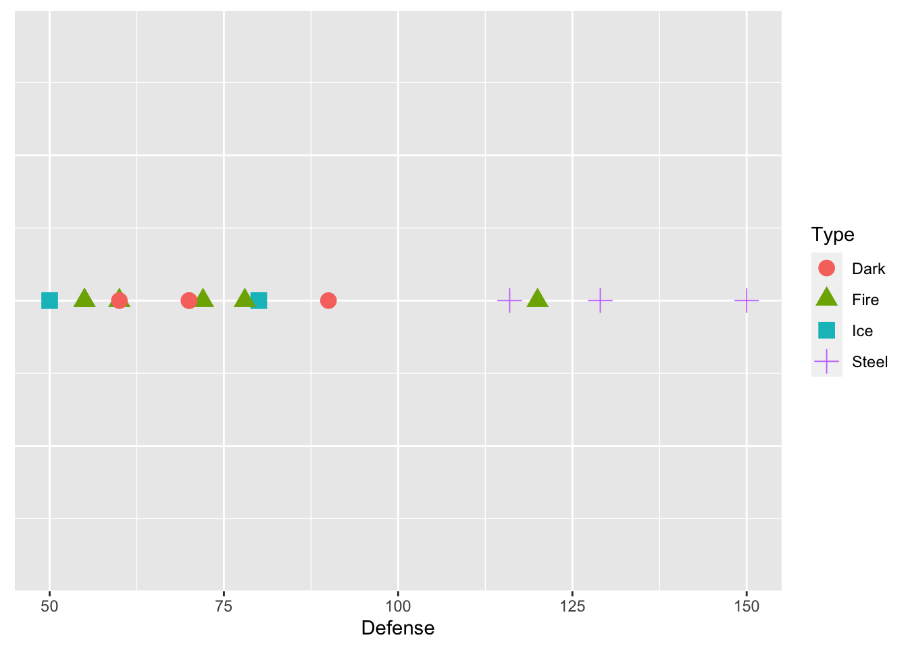
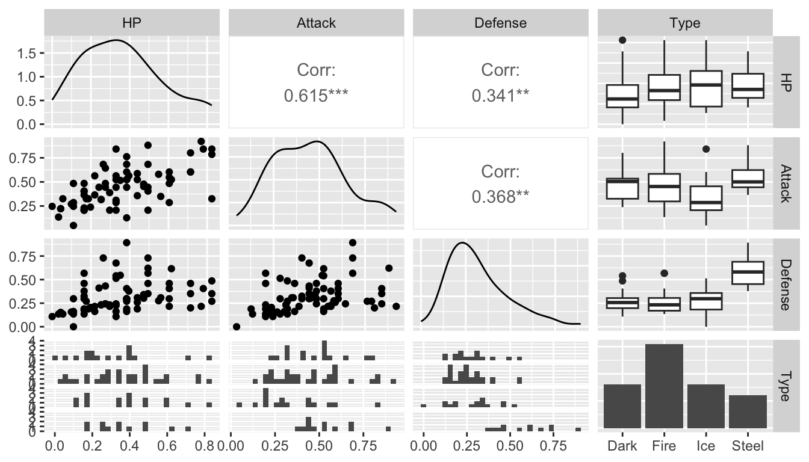
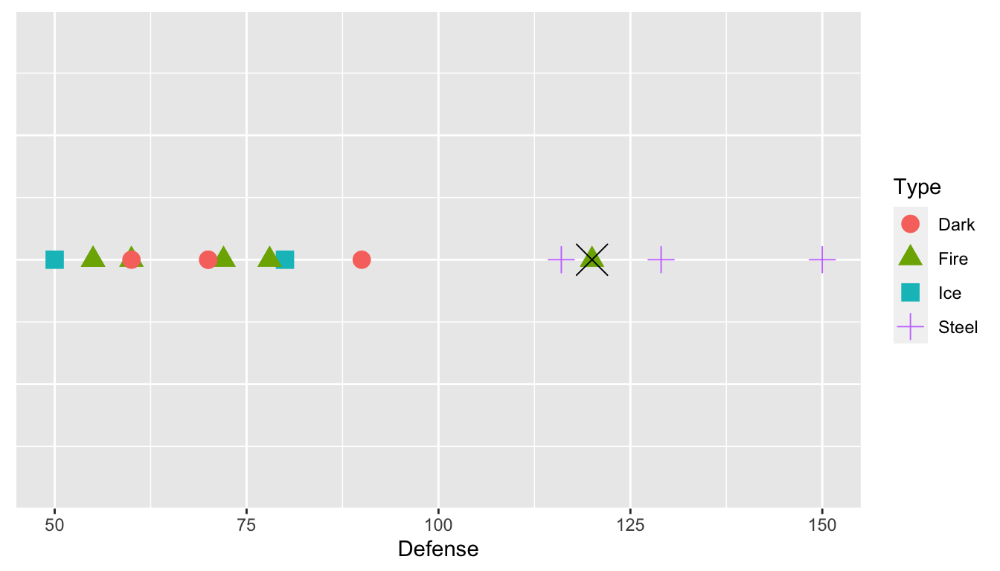
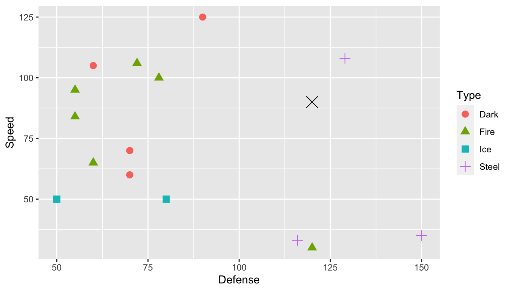
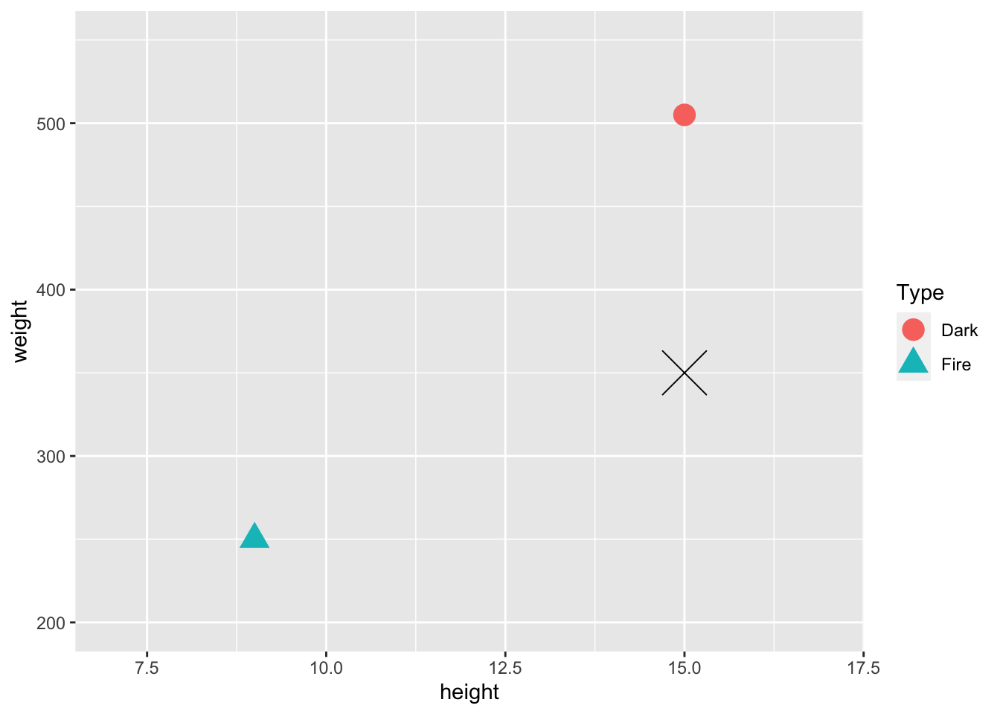
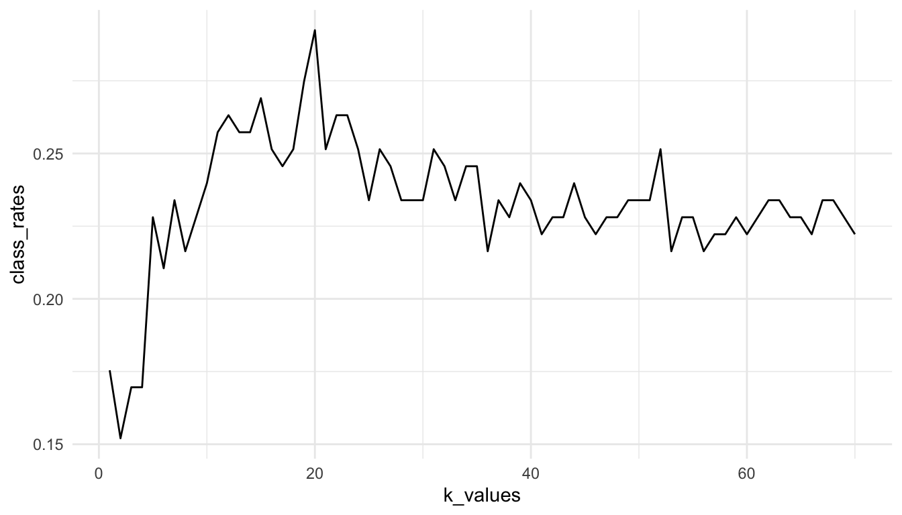
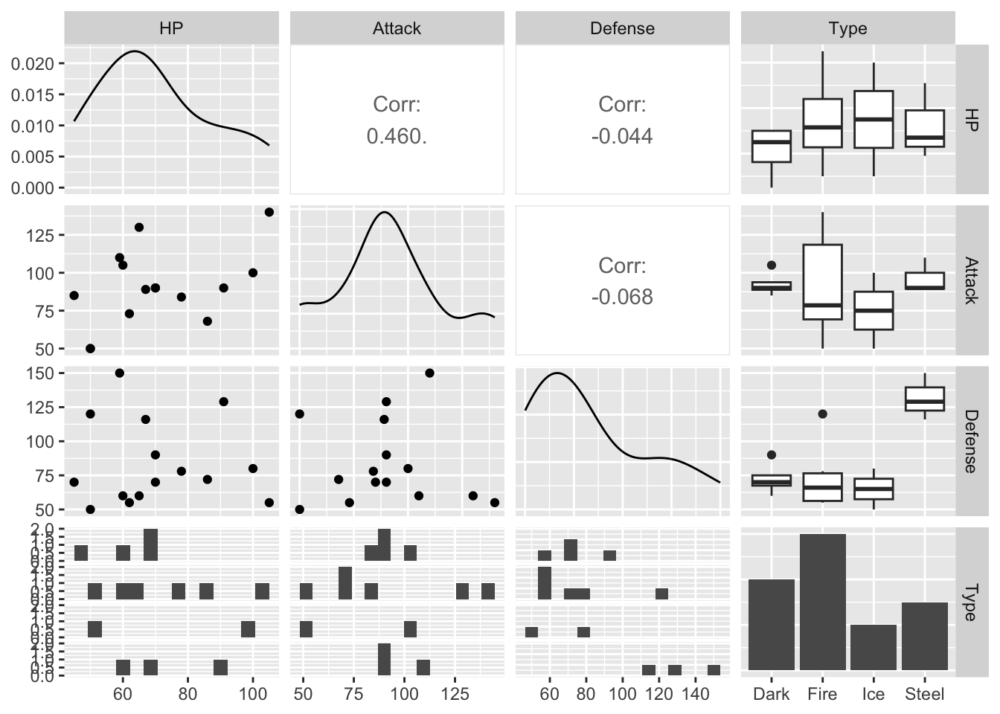

# Predictive Modeling with knn

__Goals__

* explain why it's necessary to use _training data_ and _test data_ when building a predictive model.
* describe the k-nearest neighbors (knn) procedure.
* interpret a _confusion matrix_.
* use knn to predict a the level of a categorical response variable.

## Introduction to Classification

__k-nearest neighbors__ (or __knn__) is an introductory supervised machine learning algorithm, most commonly used as a classification algorithm. Classification refers to prediction of a categorical response variable with two or more categories. For example, for a data set with SLU students, we might be interested in predicting whether or not each student graduates in four years (so the response has two categories: graduates in 4 years or doesn't). We might want to classify this response based on various student characteristics like anticipated major, GPA, standardized test scores, etc. knn can also be used to predict a quantitative response, but we'll focus on categorical responses throughout this section.

If you've had STAT 213, you might try to draw some parallels to knn and classification using logistic regression. Note, however, that logistic regression required the response to have __two__ levels while knn can classify a response variable that has __two or more__ levels.

To introduce this, we will be using `pokemon_full.csv` data. Pokemon have different Types: we will use `Type` as a categorical response that we are interested in predicting. For simplicity, we will only use Pokemon's primary type and we will only use __4__ different types: 


```r
set.seed(1119)
library(tidyverse)
library(here)
pokemon <- read_csv(here("data/pokemon_full.csv")) |>
  filter(Type %in% c("Steel", "Dark", "Fire", "Ice"))
```

Our goal is to develop a k-nearest-neighbors model that is able to classify/predict Pokemon `Type` from a set of predictors, like Pokemon `HP`, `Attack`, `Defense`, etc.

### Training and Test Data

In order to develop our knn model (note that we still haven't discussed what knn actually is yet!), we first need to discuss terms that applies to almost __all__ predictive/classification modeling: training and test data. A __training__ data set is a subset of the full data set used to fit various models. For the example below, the training data set will be just 15 observations for pedagogical purposes. More commonly, the training data set will contain 50%-80% of the observations in the full data set.

A __test__ data set consists of the remaining 20%-50% of the observations not in the training data set. A test data set is used to assess different the performances of various models that were fit using the training data set. Why do we need to do this division? Using the full data set for both training a model and testing that model is "cheating:" the model will perform better than it should because we are using each observation twice: once for fitting and once for testing. Having a separate test data set that wasn't used to fit the model gives the model a more "fair" test, as these observations are supposed to be new data that the model hasn't yet seen.

The following code uses that `sample_n()` function to randomly select 15 observations to be in the training data set. `anti_join()` then makes a test data set without the 15 pokemon in the training data set.


```r
train_sample <- pokemon |>
  sample_n(15)
test_sample <- anti_join(pokemon, train_sample)

train_sample |> head()
#> # A tibble: 6 × 14
#>    ...1 Name    Type     HP Attack Defense Speed SpAtk SpDef
#>   <dbl> <chr>   <chr> <dbl>  <dbl>   <dbl> <dbl> <dbl> <dbl>
#> 1   491 Darkrai Dark     70     90      90   125   135    90
#> 2   136 Flareon Fire     65    130      60    65    95   110
#> 3   571 Zoroark Dark     60    105      60   105   120    60
#> 4   221 Pilosw… Ice     100    100      80    50    60    60
#> 5   668 Pyroar  Fire     86     68      72   106   109    66
#> 6   262 Mighty… Dark     70     90      70    70    60    60
#> # … with 5 more variables: Generation <dbl>,
#> #   Legendary <lgl>, height <dbl>, weight <dbl>,
#> #   base_experience <dbl>
#> # ℹ Use `colnames()` to see all variable names
test_sample |> head()
#> # A tibble: 6 × 14
#>    ...1 Name    Type     HP Attack Defense Speed SpAtk SpDef
#>   <dbl> <chr>   <chr> <dbl>  <dbl>   <dbl> <dbl> <dbl> <dbl>
#> 1     4 Charma… Fire     39     52      43    65    60    50
#> 2     5 Charme… Fire     58     64      58    80    80    65
#> 3    37 Vulpix  Fire     38     41      40    65    50    65
#> 4    38 Nineta… Fire     73     76      75   100    81   100
#> 5    58 Growli… Fire     55     70      45    60    70    50
#> 6    59 Arcani… Fire     90    110      80    95   100    80
#> # … with 5 more variables: Generation <dbl>,
#> #   Legendary <lgl>, height <dbl>, weight <dbl>,
#> #   base_experience <dbl>
#> # ℹ Use `colnames()` to see all variable names
```

The ideas of a training data set and test data set are pervasive in predictive and classification models, including models not related to knn. Note that we are going to do this method because it's the simplest: if you wanted to take this a step further, you'd repeat the training and test process 5 or 10 times, using what's known as __k-fold cross-validation.__

### Exercises {#exercise-13-1}

Exercises marked with an \* indicate that the exercise has a solution at the end of the chapter at \@ref(solutions-13).

1. Explain what `anti_join()` joins on when `by` isn't specified and why not specifying a `by` argument works for this example.

## knn Introduction

### knn with k = 1 and 1 Predictor

Suppose that we have just those __15__ pokemon in our training data set. We want to predict `Type` from just one predictor, `Defense`. Below is a plot that shows the defenses of the 15 pokemon in our training data set, and has points coloured by Type and with different shapes for Type.


```r
ggplot(data = train_sample, aes(x = Defense, y = 1, colour = Type, shape = Type)) +
  geom_point(size = 4) +  theme(axis.title.y=element_blank(),
        axis.text.y = element_blank(),
        axis.ticks.y = element_blank())
```



We see from the plot that `Steel` type Pokemon tend to have pretty high defense values. Now suppose that we want to predict the `Type` for one of the Pokemon in our test data set, `Dialga`. We know that Dialga has a `Defense` stat of 120: the plot below shows Dialga marked with a large black X.


```r
dialga <- test_sample |> slice(63)
ggplot(data = train_sample, aes(x = Defense, y = 1, colour = Type, shape = Type)) +
  geom_point(size = 4) +  theme(axis.title.y=element_blank(),
        axis.text.y=element_blank(),
        axis.ticks.y=element_blank()) +
  geom_point(data = dialga, colour = "black", shape = 4, size = 7)
```



What would your prediction for `Dialga` be? Why? According to knn with `k = 1`, we would predict `Dialga` to be `Fire` type. `k = 1` means that we are using the __1st__ nearest neighbor: in this case the point that is closest to `Dialga` is a green triangle, corresponding to a `Fire` type Pokemon.

### knn with k > 1 and One Predictor

But, we might not necessarily want to predict the response value based on the single nearest neighbor. `Dialga` is also near many purple plus signs: should those factor in at all? We can extend `knn` to different values for k. For example, $k = 3$ looks at the 3 nearest neighbors, and assigns a prediction as the category that appears the __most__ among those 3 nearest neighbors.

Using `k = 3`, what would the prediction for Dialga be? Why?

### knn with k > 1 and More Than One Predictor

We can increase the number of predictors in our `knn` model as well. We can generally include as many predictors as we would like, but visualizing becomes challenging with more than 2 predictors and nearly impossible with more than 3 predictors. For the case of two predictors, suppose that we want to use Defense and Speed as our predictors for Type. `Dialga`, the Pokemon we want to predict for, is again marked with a large black X.


```r
ggplot(data = train_sample, aes(x = Defense, y = Speed, colour = Type, shape = Type)) +
  geom_point(size = 3) +
  geom_point(data = dialga, colour = "black", shape = 4, size = 5)
```



For $k = 1$, we would predict the `Dialga` is Steel, as the closest point is the purple `+` sign in the top-left corner of the graph. For $k = 3$, what `Type` would you predict for Dialga? For this question, it's a little hard to tell which three points are closest to `Dialga` without computing the distances numerically, which is something we will let `R` do with the `knn()` function.

### Scaling Predictor Variables before Using knn

In general, we want to scale any quantitative predictors when using knn because it relies on distances between points in its predictions. This is easiest to see with an example. Suppose, in our Pokemon example, that we want to use `height` and `weight` as our predictors in the `knn` model. We just have 2 observations in our training data set: a Dark Type pokemon with a height of 15 centimeters and a weight of 505 pounds, and a Fire Type Pokemon with a height of 9 centimeters and a weight of 250 pounds. 


```r
train_tiny <- train_sample |> slice(1:2)
newobs <- tibble(height = 15, weight = 350, Type = "Unknown")
ggplot(data = train_tiny, aes(x = height, y = weight, shape = Type)) +
  geom_point(size = 5, aes(colour = Type)) + xlim(c(7, 17)) + ylim(c(200, 550)) +
  geom_point(data = newobs, shape = 4, size = 10)
```



On the plot is also given a Pokemon in our test data set that we wish to predict the `Type` of, marked with a black X. Upon visual inspection, with `k = 1`, it looks like we would classify this pokemon as Dark. However, the units of weight and height are on very different scales. We will compute the actual distances in class to see if the conclusion from the calculation matches with the visual conclusion.

<br>

To get around this issue, it is customary to scale all quantitative predictors before applying knn. One method of doing this is applying

$$
scaled_x = \frac{x - min(x)}{max(x) - min(x)}
$$

For example, scaling `weight` for the 15 original pokemon:


```r
train_sample |> select(weight) |> head()
#> # A tibble: 6 × 1
#>   weight
#>    <dbl>
#> 1    505
#> 2    250
#> 3    811
#> 4    558
#> 5    815
#> 6    370
```

puts all weights between 0 and 1: 


```r
train_sample |> mutate(weight_s = (weight - min(weight)) / 
                          (max(weight) - min(weight))) |>
  select(weight_s) |>
  head()
#> # A tibble: 6 × 1
#>   weight_s
#>      <dbl>
#> 1   0.187 
#> 2   0.0835
#> 3   0.312 
#> 4   0.209 
#> 5   0.314 
#> 6   0.132
```

If we do the same with `height`, then the variables will contribute more "equally" to the distance metric used in knn. 

The code below scales all numeric variables in a data set, using the `across()` function. `across()` applies a transformation to every column in a data set that satisfies the condition given in the `where` argument.


```r
## ?across
library(pander)
train_sample |>
  mutate(across(where(is.numeric), ~ (.x - min(.x)) /
                                 (max(.x) - min(.x)))) |>
  slice(1:3)
#> # A tibble: 3 × 14
#>    ...1 Name    Type     HP Attack Defense Speed SpAtk SpDef
#>   <dbl> <chr>   <chr> <dbl>  <dbl>   <dbl> <dbl> <dbl> <dbl>
#> 1 0.720 Darkrai Dark  0.417  0.444     0.4 1     1     0.658
#> 2 0.193 Flareon Fire  0.333  0.889     0.1 0.368 0.619 0.921
#> 3 0.838 Zoroark Dark  0.25   0.611     0.1 0.789 0.857 0.263
#> # … with 5 more variables: Generation <dbl>,
#> #   Legendary <lgl>, height <dbl>, weight <dbl>,
#> #   base_experience <dbl>
#> # ℹ Use `colnames()` to see all variable names
```

### Exercises {#exercise-13-2}

Exercises marked with an \* indicate that the exercise has a solution at the end of the chapter at \@ref(solutions-13).

1. \* Consider again the toy example with just two observations in the training data set and unscaled weight and height as predictors.


```r
ggplot(data = train_tiny, aes(x = height, y = weight, shape = Type)) +
  geom_point(size = 5, aes(colour = Type)) + xlim(c(7, 17)) +
  ylim(c(200, 550)) +
  geom_point(data = newobs, shape = 4, size = 10)
```



The actual (height, weight) coordinates of the Fire pokemon are (9, 250), the actual coordinates of the Dark pokemon are (15, 505), and the actual coordinates of the test pokemon are (15, 350). We mentioned that, visually, the pokemon looks "closer" to the Dark type pokemon. Verify that this is __not__ actually the case by computing the actual distances numerically.


2. \* After scaling according to the formula in this section, the coordinates (height, weight) of the Fire pokemon are (0, 0) and the coordinates of the Dark pokemon are (1, 1). (Since there are only two observations, the formula doesn't give any output between 0 and 1 for this tiny example). The scaled coordinates for the test pokemon are (1, 0.39). Verify that, after scaling, the test pokemon is "closer" to the Dark type pokemon by numerically computing distances.


3. Consider again the example with 15 pokemon in the training data set and a single predictor, `Defense`.


```r
ggplot(data = train_sample, aes(x = Defense, y = 1, colour = Type, shape = Type)) +
  geom_point(size = 4) +  theme(axis.title.y=element_blank(),
        axis.text.y=element_blank(),
        axis.ticks.y=element_blank()) +
  geom_point(data = dialga, colour = "black", shape = 4, size = 7)
```



With k = 2, there is a tie between Fire and Steel. Come up with a way in which you might break ties in a knn algorithm.

4. Explain what knn would use as a prediction for all test observations if k equals the number of observations in the training data set.

5. What are some advantages for making k smaller and what are some advantages for making k larger?

## Choosing Predictors and k

We now know how knn classifies observations in the test data set, but how do we choose which predictors should be used by the knn algorithm? And how do we choose the number of neighbors, k? We want to measure how "good" models with different predictors and different k's do, but we first need to define what "good" means.

Much of the "choosing predictors" part will be trial and error by evaluating different models with a criterion that we will talk about in the next section. However, it is always helpful to explore the data set with graphics to get us to a good starting point. A __scatterplot matrix__ is a useful exploratory tool. The following is a scatterplot matrix with the response variable, `Type`, and just three candidate predictors, `HP`, `Attack`, and `Defense`, created with the `GGally` ("g-g-ally") package.


```r
## install.packages("GGally")
library(GGally)
#> Registered S3 method overwritten by 'GGally':
#>   method from   
#>   +.gg   ggplot2
#> 
#> Attaching package: 'GGally'
#> The following object is masked from 'package:pander':
#> 
#>     wrap
ggpairs(data = train_sample, columns = c(4, 5, 6, 3), 
        lower = list(combo = wrap(ggally_facethist, bins = 15)))
```



The `lower` argument changes the number of bins in the faceted histograms in the bottom row. You can mostly ignore this.

The `columns` argument __is__ important: it allows you to specify which columns you want to look at. I prefer putting the response, `Type` (column `3`) in the last slot.

We can examine this to see which variables seem to have a relationship with `Type`. Where would we want to look for this?

### The Confusion Matrix

But, we still need a metric to evaluate models with different predictors. One definition of a "good" model in the classification context is a model that has a high proportion of correct predictions in the test data set. This should make some intuitive sense, as we would hope that a "good" model correctly classifies most `Dark` pokemon as `Dark`, most `Fire` pokemon as `Fire`, etc. 

In order to examine the performance of a particular model, we'll create a __confusion matrix__ that shows the results of the model's classification on observations in the test data set. Note that in STAT 213, we didn't call this a confusion matrix; we instead called this a classification table. 

The following video explains confusion matrices in more detail and should also cement the ideas of training and test data. <a href="https://www.youtube.com/watch?v=Kdsp6soqA7o" target="_blank">https://www.youtube.com/watch?v=Kdsp6soqA7o</a>.

### Using knn in `R`

To make a confusion matrix for a model using the pokemon data set, we first need to obtain predictions from a model. We'll use the `class` library to fit a knn model to the pokemon data. Note that, instead of having 15 Pokemon in our training data set, we now have __70__ pokemon to give a more reasonable number. The test set has the remaining __50__ pokemon.

The following code chunk sets a seed so that we all get the same training and test samples, scales all numeric variables in the pokemon data set, and then randomly selects 70 pokemon to be in the training sample.


```r
library(tidyverse)
set.seed(11232020) ## run this line so that you get the same 
## results as I do!

## scale the quantitative predictors
pokemon_scaled <- pokemon |>
    mutate(across(where(is.numeric), ~ (.x - min(.x)) /
                                 (max(.x) - min(.x)))) 

train_sample_2 <- pokemon_scaled |>
  sample_n(70)
test_sample_2 <- anti_join(pokemon_scaled, train_sample_2)
#> Joining, by = c("...1", "Name", "Type", "HP", "Attack",
#> "Defense", "Speed", "SpAtk", "SpDef", "Generation",
#> "Legendary", "height", "weight", "base_experience")
```

The first knn model we will investigate will have `HP`, `Attack`, `Defense`, and `Speed` as predictors. The `class` library can fit knn models with a `knn()` function but requires the training and test data sets to have __only__ the predictors that we want to use to fit the model. The `knn()` function also requires the response variable, `Type`, to be given as a vector.


```r
## install.packages("class")
library(class)

## create a data frame that only has the predictors
## that we will use
train_small <- train_sample_2 |> select(HP, Attack, Defense, Speed)
test_small <- test_sample_2 |> select(HP, Attack, Defense, Speed)

## put our response variable into a vector
train_cat <- train_sample_2$Type
test_cat <- test_sample_2$Type
```

Now that the data has been prepared for the `knn()` function in the `class` library, we fit the model with 9 nearest neighbors. The arguments to `knn()` are 

* `train`, a data set with the training data that contains only the predictors we want to use (and not other predictors or the response).
* `test`, a data set with the test data that contains only the predictors we want to use (and not other predictors or the response).
* `cl`, a vector of the response variable for the training data.
* `k`, the number of nearest neighbors.


```r
## fit the knn model with 9 nearest neighbors
knn_mod <- knn(train = train_small, test = test_small,
               cl = train_cat, k = 9)
knn_mod
#>  [1] Ice   Fire  Fire  Fire  Fire  Fire  Steel Fire  Ice  
#> [10] Fire  Fire  Fire  Fire  Ice   Ice   Steel Ice   Dark 
#> [19] Ice   Fire  Steel Fire  Fire  Ice   Fire  Ice   Steel
#> [28] Fire  Fire  Ice   Dark  Fire  Fire  Fire  Dark  Ice  
#> [37] Ice   Fire  Ice   Fire  Fire  Fire  Fire  Fire  Fire 
#> [46] Fire  Fire  Fire  Ice   Fire 
#> Levels: Dark Fire Ice Steel
```

The output of `knn_mod` gives the predicted categories for the __test__ sample. We can compare the predictions from the knn model with the actual pokemon `Type`s in the test sample with `table()`, which makes a confusion matrix:


```r
table(knn_mod, test_cat) 
#>        test_cat
#> knn_mod Dark Fire Ice Steel
#>   Dark     0    3   0     0
#>   Fire     6   13   7     4
#>   Ice      5    5   2     1
#>   Steel    0    1   0     3
```

The columns of the confusion matrix give the actual Pokemon types in the test data while the rows give the predicted types from our knn model. The above table tells us that there were 0 pokemon that were Dark type that our knn model correctly classified as Dark. There were 6 pokemon that were Dark type that our knn model incorrectly classified as Fire. There were 5 pokemon that were Dark type and that our knn model incorrectly classified as Ice. In other words, correct predictions appear on the diagonal, while incorrect predictions appear on the off-diagonal. 

One common metric used to assess overall model performance is the model's __classification rate__, which is computed as the number of correct classifications divided by the total number of observations in the test data set. In this case, our classification rate is


```r
(0 + 13 + 2 + 3) / 50
#> [1] 0.36
```

Code to automatically obtain the classification rate from a confusion matrix is


```r
tab <- table(knn_mod, test_cat) 
sum(diag(tab)) / sum(tab)
#> [1] 0.36
```

What does `diag()` seem to do in the code above?

### Exercises {#exercise-13-3}

Exercises marked with an \* indicate that the exercise has a solution at the end of the chapter at \@ref(solutions-13).

1. Change the predictors used or change k to improve the classification rate of the model with `k = 9` and `Attack`, `Defense`, `HP`, and `Speed` as predictors.

## Chapter Exercises {#chapexercise-13}

There will be no chapter exercises for this section. Instead, we'll devote some in-class time for you to begin work on your final project.

## Exercise Solutions {#solutions-13}

### Introduction to Classification S

### knn Introduction S

1. \* Consider again the toy example with just two observations in the training data set and unscaled weight and height as predictors.


```r
ggplot(data = train_tiny, aes(x = height, y = weight, shape = Type)) +
  geom_point(size = 5, aes(colour = Type)) + xlim(c(7, 17)) +
  ylim(c(200, 550)) +
  geom_point(data = newobs, shape = 4, size = 10)
```


The actual (height, weight) coordinates of the Fire pokemon are (9, 250), the actual coordinates of the Dark pokemon are (15, 505), and the actual coordinates of the test pokemon are (15, 350). We mentioned that, visually, the pokemon looks "closer" to the Dark type pokemon. Verify that this is __not__ the case by computing the actual distances numerically.


2. \* After scaling according to the formula in this section, the coordinates (height, weight) of the Fire pokemon are (0, 0) and the coordinates of the Dark pokemon are (1, 1). (Since there are only two observations, the formula doesn't give any output between 0 and 1 for this tiny example). The scaled coordinates for the test pokemon are (1, 0.39). Verify that, after scaling, the test pokemon is "closer" to the Dark type pokemon bu numerically computing distances.


### Choosing Predictors and k S

## Non-Exercise `R` Code {#rcode-13}


```r
set.seed(1119)
library(tidyverse)
library(here)
pokemon <- read_csv(here("data/pokemon_full.csv")) |>
  filter(Type %in% c("Steel", "Dark", "Fire", "Ice"))
train_sample <- pokemon |>
  sample_n(15)
test_sample <- anti_join(pokemon, train_sample)

train_sample |> head()
test_sample |> head()
ggplot(data = train_sample, aes(x = Defense, y = 1, colour = Type, shape = Type)) +
  geom_point(size = 4) +  theme(axis.title.y=element_blank(),
        axis.text.y = element_blank(),
        axis.ticks.y = element_blank())
dialga <- test_sample |> slice(63)
ggplot(data = train_sample, aes(x = Defense, y = 1, colour = Type, shape = Type)) +
  geom_point(size = 4) +  theme(axis.title.y=element_blank(),
        axis.text.y=element_blank(),
        axis.ticks.y=element_blank()) +
  geom_point(data = dialga, colour = "black", shape = 4, size = 7)
ggplot(data = train_sample, aes(x = Defense, y = Speed, colour = Type, shape = Type)) +
  geom_point(size = 3) +
  geom_point(data = dialga, colour = "black", shape = 4, size = 5)
train_tiny <- train_sample |> slice(1:2)
newobs <- tibble(height = 15, weight = 350, Type = "Unknown")
ggplot(data = train_tiny, aes(x = height, y = weight, shape = Type)) +
  geom_point(size = 5, aes(colour = Type)) + xlim(c(7, 17)) + ylim(c(200, 550)) +
  geom_point(data = newobs, shape = 4, size = 10)
train_sample |> select(weight) |> head()
train_sample |> mutate(weight_s = (weight - min(weight)) / 
                          (max(weight) - min(weight))) |>
  select(weight_s) |>
  head()
## ?across
library(pander)
train_sample |>
  mutate(across(where(is.numeric), ~ (.x - min(.x)) /
                                 (max(.x) - min(.x)))) |>
  slice(1:3)
## install.packages("GGally")
library(GGally)
ggpairs(data = train_sample, columns = c(4, 5, 6, 3), 
        lower = list(combo = wrap(ggally_facethist, bins = 15)))
library(tidyverse)
set.seed(11232020) ## run this line so that you get the same 
## results as I do!

## scale the quantitative predictors
pokemon_scaled <- pokemon |>
    mutate(across(where(is.numeric), ~ (.x - min(.x)) /
                                 (max(.x) - min(.x)))) 

train_sample_2 <- pokemon_scaled |>
  sample_n(70)
test_sample_2 <- anti_join(pokemon_scaled, train_sample_2)
## install.packages("class")
library(class)

## create a data frame that only has the predictors
## that we will use
train_small <- train_sample_2 |> select(HP, Attack, Defense, Speed)
test_small <- test_sample_2 |> select(HP, Attack, Defense, Speed)

## put our response variable into a vector
train_cat <- train_sample_2$Type
test_cat <- test_sample_2$Type
## fit the knn model with 9 nearest neighbors
knn_mod <- knn(train = train_small, test = test_small,
               cl = train_cat, k = 9)
knn_mod
table(knn_mod, test_cat) 
(0 + 13 + 2 + 3) / 50
tab <- table(knn_mod, test_cat) 
sum(diag(tab)) / sum(tab)
```


